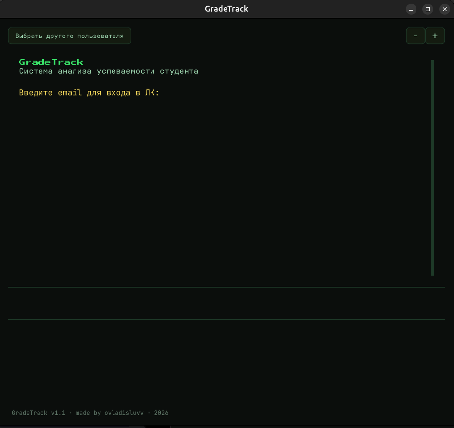
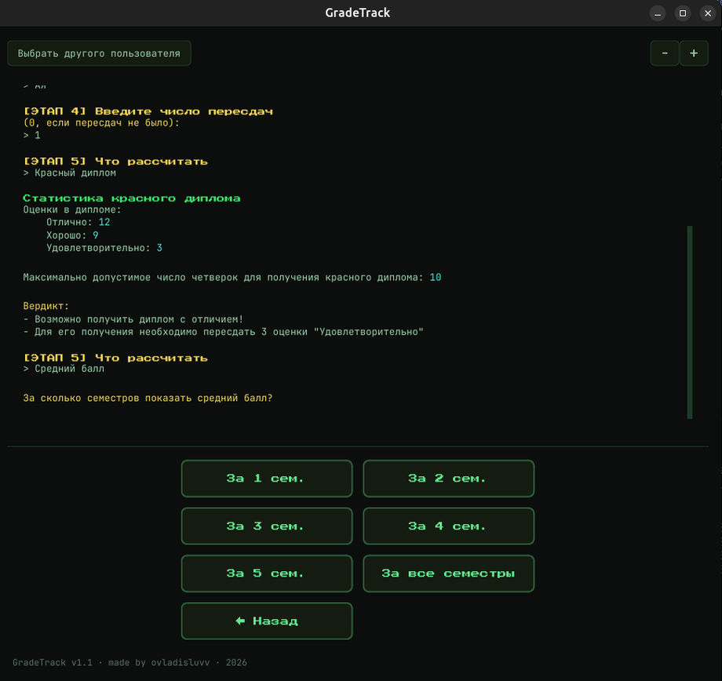
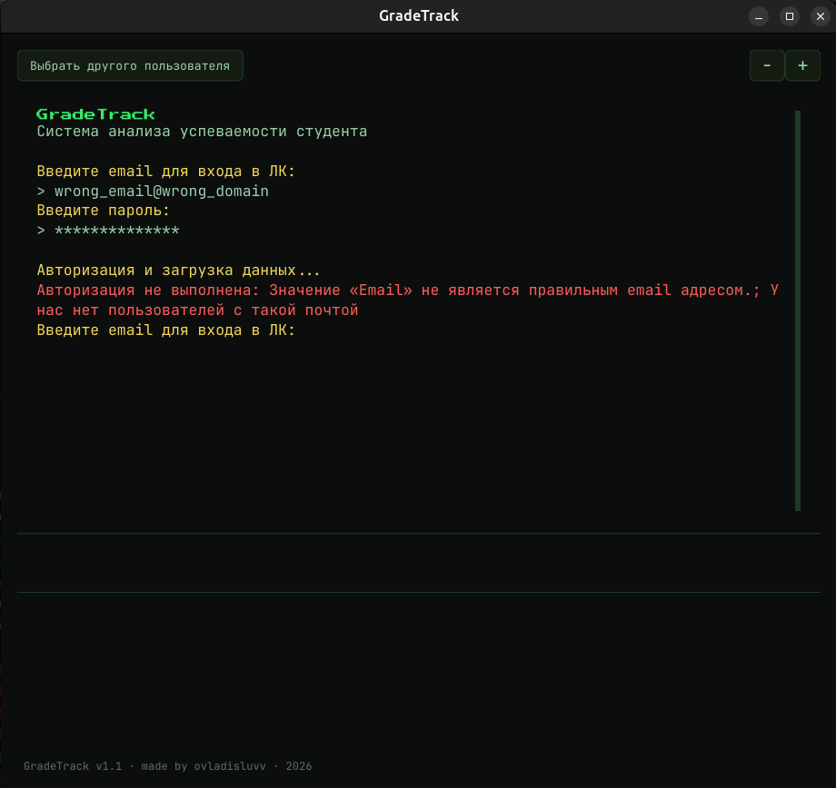

# GradeTrack
## Анализ успеваемости студентов МГУ

GradeTrack авторизуется в личном кабинете МГУ (`lk.msu.ru`), забирает оттуда страницу с оценками,
считает средний балл (с учетом и без учета пересдач, в том числе по отдельным семестрам) и проверяет,
достижим ли диплом с отличием («красный диплом») - по спискам предметов, которые входят в диплом
для конкретного факультета/программы/кафедры

<p align="center">
  
  
  
</p>

> **Важно.** Полноценно, со всеми возможностями (включая проверку красного диплома), приложение сейчас
> работает только для **бакалавров ВМК**. Студентам остальных факультетов пока доступен только
> подсчет среднего балла с учетом и без учета пересдач

## Возможности

### Десктоп-приложение (GUI)
Графический интерфейс на PyQt6 в стиле терминала:
* Пошаговый мастер ведет студента по шагам: **логин → пароль → выбор факультета → выбор программы → выбор кафедры (можно пропустить, если пройдено <5 семестров) → число пересдач → выбор действия**
* Два действия на выбор:
  * **Средний балл** - с указанием диапазона семестров
  * **Красный диплом** - статистика оценок диплома, максимально допустимое число четверок и вердикт о достижимости диплома с отличием
* Логин и скрейпинг данных с портала выполняются в фоновом потоке, не блокируя интерфейс
* Кнопка «← Назад» на каждом шаге и кнопка «Выбрать другого пользователя» для полного сброса сессии
* Масштабирование текста терминала (Клавишами `+` и `−` или кнопками на экране)

### Расчеты
* Средний балл с учетом пересдач (каждая пересдача учитывается как оценка «2») и без их учета
* Средний балл только по указанным семестрам либо за весь период обучения
* Статистика оценок, входящих в диплом (количество «отлично» / «хорошо» / «удовлетворительно»)
* Проверка диплома с отличием: диплом с отличием недостижим при более чем 3 оценках «удовлетворительно»
  в дипломе или при доле «хорошо» выше 25% (с поправкой на то, что до 3 таких предметов еще можно
  пересдать). При достижимости - сообщение о том, сколько и какие оценки нужно пересдать

## Архитектура проекта

Архитектура реализована так, что каждый слой обращается только к нижележащим через `__init__.py` пакета:

* **`src/web`** - работа с HTTP-сессией: `auth.py` логинится в личном кабинете (получает CSRF-токен со
  страницы входа и отправляет форму, при проблемах бросает типизированные исключения из `exceptions.py`
  - неверный email/пароль, недоступность страниц, изменившаяся разметка), `scraper.py` скачивает HTML
  страницы с оценками уже авторизованной сессией. Разбора HTML здесь нет
* **`src/core`** - чистая бизнес-логика без сетевого I/O:
  * `parser.py` - преобразовывает HTML-страницу оценок в объект `GradeInfo` (предмет, оценка текстом,
    семестр)
  * `preprocessor.py` - переводит текстовые оценки («отл» / «хор» / «удов» / «не...») в числовые 5/4/3,
    отбрасывает непройденные/неоцененные предметы и помечает каждую оценку признаком `in_diploma` (входит в диплом)
  * `diploma_subjects.py` - определяет, какие предметы входят в диплом, читая
    `data/in_diploma/<факультет>/<программа>/sem{1..4}.txt` и, для семестров старше 4-го,
    `.../<кафедра>/sem{N}.txt`
  * `analyzer.py` - расчет среднего балла, статистики по диплому и проверка возможности получения диплома с отличием
  * `grade_models.py` - классы моделей данных
* **`src/services/grades_service.py`** - сшивает `web` и `core`: 
  * `analyze_from_web` - полный цикл
  скрейпинга и анализа
  * `analyze_from_html` - анализ по уже готовому HTML
* **`src/utils`** - загрузка YAML-конфигов (`config_loader.py`) и разрешение путей к ресурсам,
  одинаково работающее и при запуске из исходников, и из собранного PyInstaller-исполняемого файла
  (`resources.py`)
* **`src/gui`** - десктоп-интерфейс на PyQt6:
  * `theme.py` - цветовая палитра, загрузка шрифтов, общий стиль
  * `terminal_view.py` - экран вывода с эффектом печати и встроенной строкой ввода консоли
  * `wizard_view.py` - сетка кнопок выбора, динамически строящаяся по текущему шагу
  * `state_manager.py` - Контроллер, ведущий весь сценарий мастера и запускающий сетевые операции в фоновом потоке
  * `app.py` - точка входа GUI, собирает окно приложения и его виджеты

## Установка и запуск

### Вариант 1 - готовый исполняемый файл
На странице **Releases** публикуются собранные PyInstaller-исполняемые файлы для Linux, Windows и macOS
(Intel и Apple Silicon) - скачайте архив под свою платформу, распакуйте и запустите исполняемый файл.
Сборка выполняется автоматически при публикации тега версии

### Вариант 2 - Docker
Образ публикуется в GitHub Container Registry при каждом пуше в `main` и при тегах версий. Для запуска
GUI-приложения в контейнере на Linux с X11 подойдет `docker-compose.yml` из репозитория:
```bash
docker compose up --build
```
Каталоги `config` и `data` монтируются с хоста, так что конфигурацию и кэш оценок можно редактировать
снаружи контейнера

### Вариант 3 - запуск из исходников
Зависимости (PyQt6, beautifulsoup4, PyYAML, requests) перечислены в `requirements.txt`:
```bash
python -m venv .venv
source .venv/bin/activate  # или .venv\Scripts\activate на Windows
pip install -r requirements.txt
```

Запуск графического интерфейса:
```bash
cd src && python -m gui.app
```

## Требования

* Python 3.12
* Графическая среда с поддержкой OpenGL - для запуска GUI (в Docker на Linux дополнительно нужен доступ
  к X11)


## Лицензия

Исходный код GradeTrack распространяется по лицензии MIT - см. `LICENCE`

Файлы директории `data/` предоставляются исключительно в информационных целях и не распространяются на условиях лицензии MIT, применяемой к исходному коду проекта (подробнее - в `data/README.md`)

## Автор

Владислав Огай ([ovladisluvv](https://github.com/ovladisluvv)), 2026
